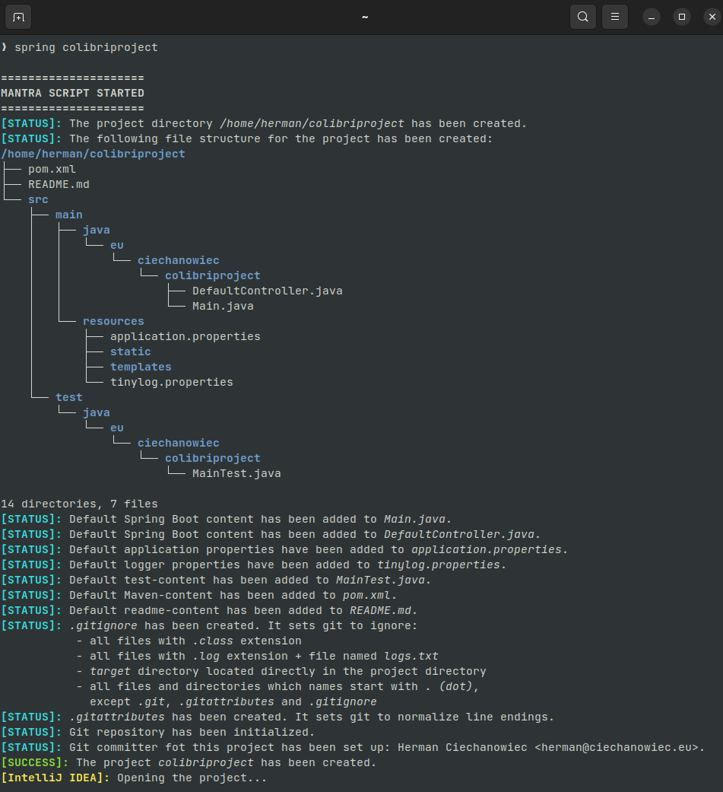

# Spring Mantra

## Table of Contents
1. [Basic Info](#Basic-Info)
2. [Prerequisites](#Prerequisites)
3. [Script's Algorithm](#Scripts-Algorithm)
4. [How to Use](#How-to-Use)
5. [Screenshots](#Screenshots)
6. [License](#License)

## Basic Info
This program is a Shell script for Linux Ubuntu. Its purpose is to provide an easy-to-use and convenient tool for creating clean Spring Boot projects with basic dependencies and configuration out of the box (Maven, Git, Lombok etc.).
| Parameter             | Data                                             |
| :-------------------: | :----------------------------------------------: |
| Program name:         | Spring Mantra                                           |
| Date of creation:     | May 2022                                         |
| Technologies used:    | Shell, Linux Ubuntu,<br/> Maven, Spring Boot     |
| Author:               | Herman Ciechanowiec <br/> herman@ciechanowiec.eu |
| License:              | MIT No Attribution License                       |

## Prerequisites
Obligatory:
1. `tree` package from https://snapcraft.io/tree (to install it run `sudo snap install tree`)
2. `git` package (to install it run `sudo apt install git`)

Facultative (one of them, both or none):
1. IntelliJ IDEA Community
2. Visual Studio Code

## Script's Algorithm
The script is executed according to the following algorithm:

1\. Show welcome message<br/>
2\. Verify initial conditions:<br/>
2.1. `tree` package is installed<br/>
2.2. `git` package is installed<br/>
2.3. exactly one or two arguments were provided (exact number of required arguments depends on configuration, by default two are required):<br/>
2.3.1. an absolute path where the project directory is to be created (if this argument is required by configuration)<br/>
2.3.2. a project name<br/>
2.4. the absolute path where the project directory is to be created (the path passed to the command or hardcoded during the configuration) is correct<br/>
2.5. the provided project name is correct (should consist only of lower case letters and numbers; the first character should be a letter)<br/>
2.6. the project directory hasn’t existed yet<br/>
3\. Create the project directory (name of the project directory is the project name)<br/>
4\. In the project directory create the file structure according to the following template:<br/>
```
/home/herman/colibriproject
├── pom.xml
├── README.md
└── src
    ├── main
    │   ├── java
    │   │   └── eu
    │   │       └── ciechanowiec
    │   │           └── colibriproject
    │   │               ├── DefaultController.java
    │   │               └── Main.java
    │   └── resources
    │       ├── application.properties
    │       ├── static
    │       ├── templates
    │       └── tinylog.properties
    └── test
        └── java
            └── eu
                └── ciechanowiec
                    └── colibriproject
                        └── MainTest.java

```     
The above file structure implements the default file structure used by Spring Boot when initializing projects at https://start.spring.io/ (captured on May 2022)<br/>
5\. Add default Spring Boot content to `Main.java` <br/>
6\. Add default Spring Boot content to `DefaultController.java` <br/>
7\. Add default application properties to `application.properties`<br/>
8\. Add default logger properties to `tinylog.properties` (logging to a file)<br/>
9\. Add default test content to `MainTest.java` (testing whether the context was loaded)<br/>
10\. Add default Maven-content to `pom.xml`<br/>
11\. Add default content to `README.md` (the project name and date of creation)<br/>
12\. Add `.gitignore` file which sets git to ignore:<br/>
12.1. all files with `.class` extension<br/>
12.2. all files with `.log` extension + file named `logs.txt`<br/>
12.4. `target` directory located directly in the project directory<br/>
12.5. all files and directories which names start with `.` (dot), except `.git`, `.gitattributes` and `.gitignore`<br/>
13\. Add `.gitattributes` file which normalizes line endings<br/>
14\. Initialize git repository in the project directory<br/>
15\. Set up git committer<br/>
16\. Show finish message on successful project creation<br/>
17\. Open the project directory in the new window with IntelliJ IDEA Community or Visual Studio Code if installed (this option works if it was turned on during configuration, by default it is turned off)

## How to Use
1. Make sure that prerequisites listed above are installed
2. Put the script (file `.spring_mantra.sh`) to the home folder so that its path will be `~/.spring_mantra.sh`
3. At the end of the script (file `.spring_mantra.sh`), after the comment-banner `DRIVER CODE`, there are 3 blocks of code encapsulated inside the pair-comments `>> START OF A CONFIGURABLE BLOCK` and `<< END OF A CONFIGURABLE BLOCK`. Configure the code in that blocks according to the clues contained in that blocks
4. Give the script a permission to be run (`chmod 755 ~/.spring_mantra.sh`)
5. Set up the following alias for the terminal (on Linux Ubuntu aliases are usually specified in the hidden file `~/.bashrc`):<br>
   `alias spring='~/.spring_mantra.sh'`
6. Restart all instances of the terminal
7. Now Spring Mantra can be run by invoking the `spring` command

## Screenshots
<kbd></kbd><br/>

## License
The program is subject to MIT No Attribution License

Copyright © 2022 Herman Ciechanowiec

Permission is hereby granted, free of charge, to any person obtaining a copy of this
software and associated documentation files (the 'Software'), to deal in the Software
without restriction, including without limitation the rights to use, copy, modify,
merge, publish, distribute, sublicense, and/or sell copies of the Software, and to
permit persons to whom the Software is furnished to do so.

The Software is provided 'as is', without warranty of any kind, express or implied,
including but not limited to the warranties of merchantability, fitness for a
particular purpose and noninfringement. In no event shall the authors or copyright
holders be liable for any claim, damages or other liability, whether in an action
of contract, tort or otherwise, arising from, out of or in connection with the
Software or the use or other dealings in the Software.
